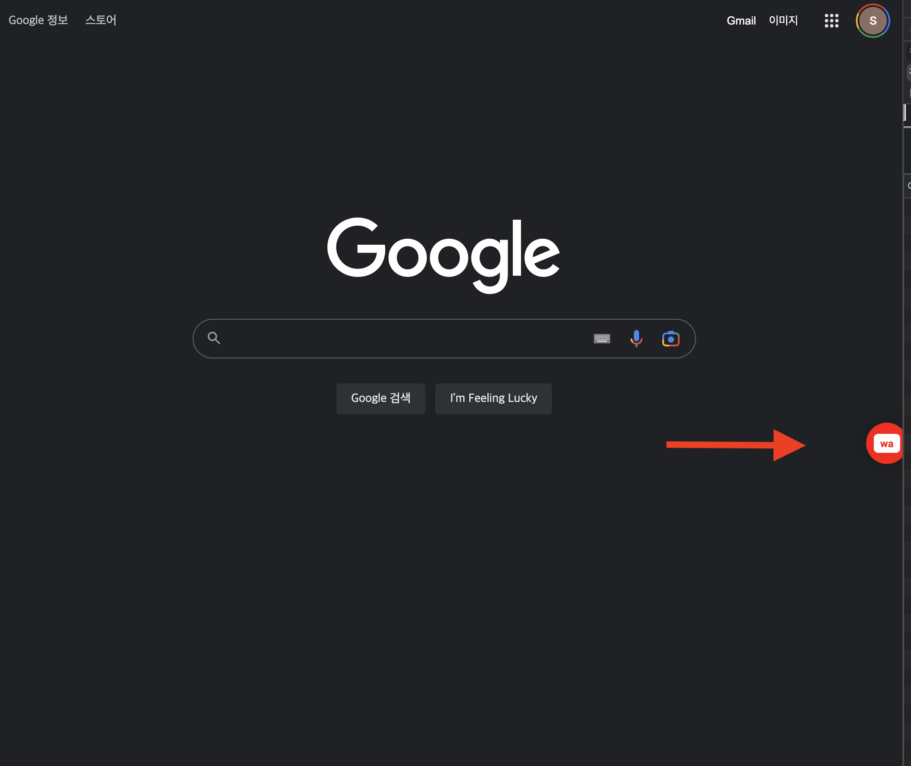
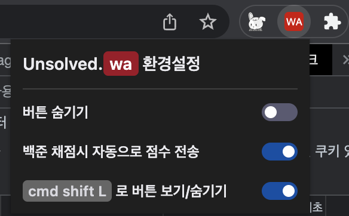
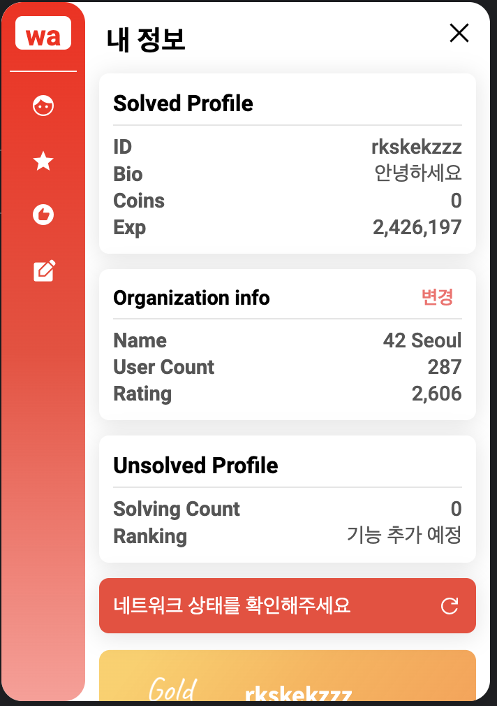

<h1 align="center">
    
</h1>

  <h3 align="center"> Unsolved Extension </h3>
  
  
  

<b>boj 학교/회사 랭킹 서비스</b> 
<b>Unsolved</b> 로 boj 학교/회사 랭킹 올리기

## :bulb: Introduction

-   **📝 추천 문제**

    > 매일 추천 문제와 학교/회사 랭킹에 기여하는 문제를 확인할 수 있습니다!

-   **🏆️ 기여도 시스템**

    > 학교/회사 랭킹에 기여하는 문제를 푼 유저에게 기여도를 제공하고 전체, 월간 유저 간의 기여도 랭킹으로 기여도 순위를 확인 할 수 있습니다.

 

## 💻 Test

| Unsolved Extension을 직접 테스트 해보고 싶다면 [본 가이드](./TEST_GUIDE.md)를 참고해 주세요!

## :tada: Useage

### Extension 설치 후

아래와 같이 귀여운 아이콘이 브라우저 우측에 생성됩니다!

아래 단축키를 사용해 아이콘을 보이게 하거나 숨길 수 있습니다.

-   MAC - `cmd + shift + 8`
-   WIN - `ctrl + shift + 8`

 

 

또는 브라우저의 우측 상단, Extension 아이콘을 눌러서 직접 설정할 수 있습니다. **버튼 숨기기** 기능을 활용하면 버튼을 숨길 수 있습니다.

| 💡 _우측 상단의 옵션 창은 `cmd + shift + 9`를 활용해 켜고 끌 수 있습니다!_

 

 

| 💡 _Unsolved Extension은 Chrome의 모든 tab에서 독립적으로 동작하지만, 숨기기 기능은 모든 tab에서 동일하게 적용됩니다!_

 

### 버튼을 누르면!

메인 화면인 **내 정보** 에서는 [Solved.ac](https://solved.ac)에서 제공하는 정보들과 [백준의 Organization 정보](https://www.acmicpc.net/setting/school)들이 나열됩니다.

 

만약 해당 Organization이 **Unsolved 서비스에 등록**되어 있다면 Unsolved 프로필도 확인할 수 있습니다.

 

| 💡 Organization을 Unsolved 서비스에 등록하려면 [본 가이드](./ORGANIZATION_GUIDE.md)를 참고해주세요

 

 

추가로 [Mazassumnida](https://github.com/mazassumnida/mazassumnida) 프로젝트의 뱃지도 확인할 수 있습니다.
