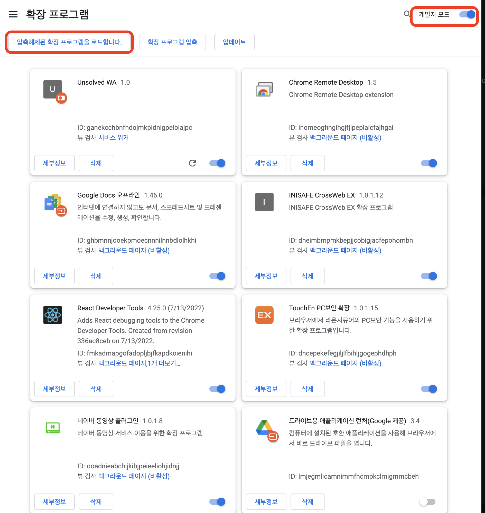
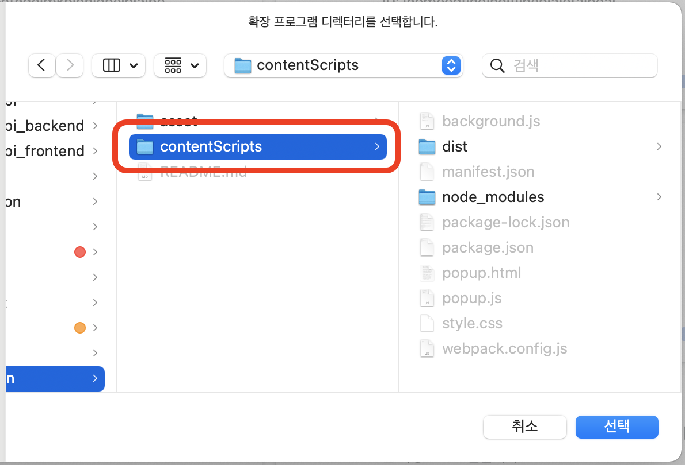
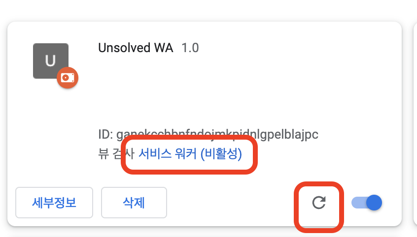

# unsolved-extension

## Usage

1. 레포지토리 클론하기

```
git clone https://github.com/UNSOLVED-WA/unsolved-extension
```

2. 크롬 브라우저에서 아래 링크로 접속하기

```
chrome://extensions
```

3. 우측 상단의 개발자 모드를 켜고, 압축해제된 확장 프로그램을 로드합니다 클릭.
   

4. contentScripts 폴더 전체를 선택(manifest.json 파일이 들어있는 폴더를 선택해야함.)
   

5. 개발 후 새로고침과 서비스 워커를 활용해서 디버깅
   

## 디렉토리 구조

```shell
unsolved-extention
├── README.md
├── asset
├── extension
│   ├── dist                  # build file for Load
│   └── src
│   │   ├── background        # background script
│   │   ├── contentScript     # conteent script(for injection)
│   │   ├── popup             # action script
│   │   ├── static            # manifest.json & images
│   │   ├── test              # experimental function
│   │   └── utils             # common utility functions
└── lagacy_with_vanilla_js
```
