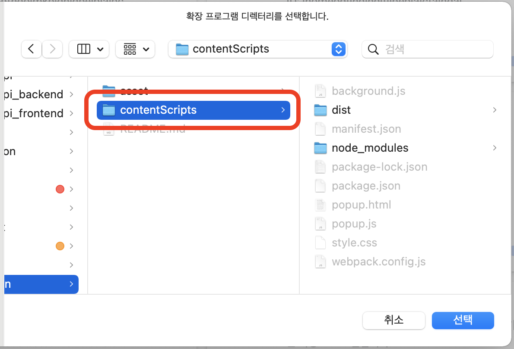
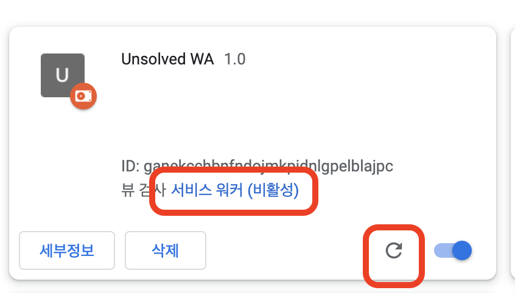

# Unsolved.wa 테스트 방법

unsolved.wa를 로컬에서 설치하고 실행하는 방법을 정리해였습니다. 순서대로 진행해주세요.

## Backend 설정

### 1. **프로젝트 클론**

```shell
git clone https://github.com/UNSOLVED-WA/unsolved-back-end.git
```

### 2. **.env 파일생성**

```shell
DB_NAME=DB이름
DB_PASSWORD=DB비밀번호
```

### 3. **이미지가 있으면 지우기 및 백엔드 어플리케이션 실행**

```shell
docker rmi unsolvedwa/backend-api
docker compose up --build -d
```

### 5. **필요한 데이터 추가**

```mysql
INSERT INTO TEAM VALUES (0, '2020-02-02','2020-02-02','42 Seoul');
INSERT INTO PROBLEM VALUES (0, '2020-02-02', '2020-02-02', 1000, 1, 'a+b');
```

### 6. **mysql 접속**

```shell
docker exec -it unsolvedwa-db bash
mysql -u root -p
use unsolved_wa;
```

## Frontend 설정

### 1. 레포지토리 클론하기 및 빌드하기

```shell
git clone https://github.com/UNSOLVED-WA/unsolved-extension
cd unsolved-extension/extension
npm run build
```

### 2. 크롬 브라우저에서 아래 링크로 접속하기

```
chrome://extensions
```

### 3. 우측 상단의 개발자 모드를 켜고, 압축해제된 확장 프로그램을 로드합니다 클릭.


### 4. contentScripts 폴더 전체를 선택(manifest.json 파일이 들어있는 폴더를 선택해야함.)



### 5. 개발 후 새로고침과 서비스 워커를 활용해서 디버깅



## 디렉토리 구조

```shell
unsolved-extention
├── README.md
├── asset
├── extension
│   ├── dist                  # build file for Load
│   └── src
│   │   ├── background        # background script
│   │   ├── contentScript     # conteent script(for injection)
│   │   ├── popup             # action script
│   │   ├── static            # manifest.json & images
│   │   ├── test              # experimental function
│   │   └── utils             # common utility functions
└── lagacy_with_vanilla_js
```
